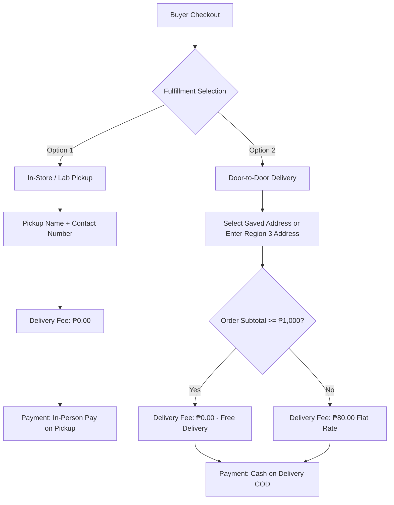
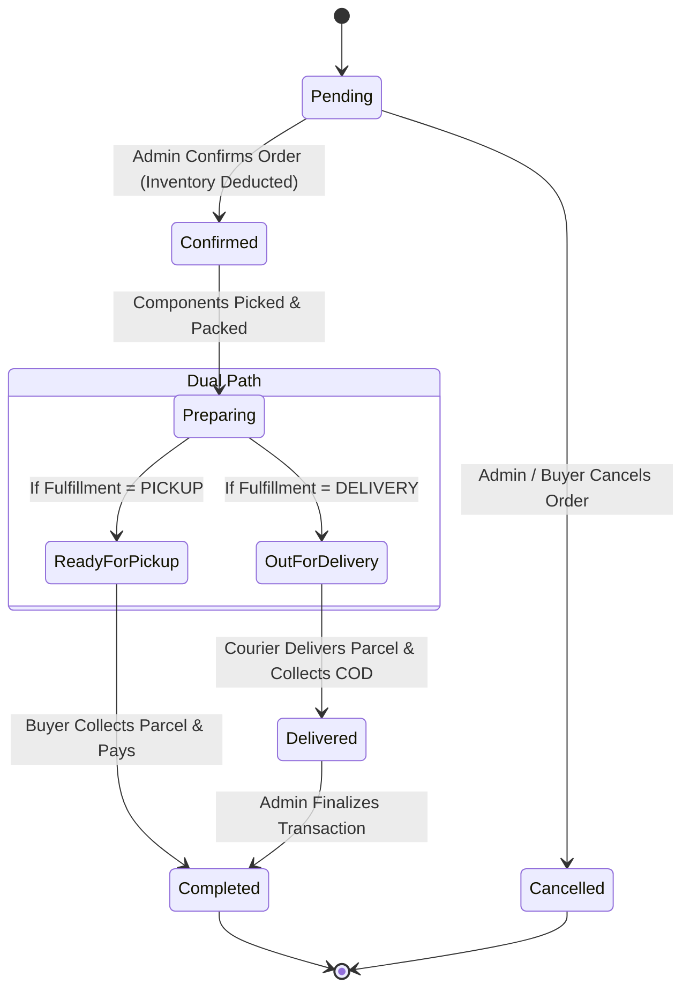

# OhmSim Fulfillment, Delivery & Payment Specification

**Product**: OhmSim by NEXORA Labs  
**Target Scope**: Version 1.0 (MVP)  
**Document Status**: Approved by Project Manager  
**Reference**: `docs/OHMSIM DOCUMENTATION - FINAL.docx`

---

## 1. Fulfillment Overview

OhmSim Version 1.0 supports a **dual fulfillment model** allowing buyers to choose between physical on-site pickup or local door-to-door delivery.



---

## 2. Fulfillment Modes

### Option A: In-Store / Lab Pickup
* **Location**: Designated Campus Electronics Lab / Store Station.
* **Required Information**:
  * Recipient / Pickup Name
  * Contact Number (e.g., `09XXXXXXXXX`)
  * Optional Order Notes / Estimated Pickup Time
* **Delivery Fee**: **₱0.00** (Always free).
* **Payment Mode**: In-person Pay on Pickup.

### Option B: Door-to-Door Delivery
* **Coverage Area**: Strictly **Region 3 (Central Luzon)**:
  * Aurora
  * Bataan
  * Bulacan
  * Nueva Ecija
  * Pampanga
  * Tarlac
  * Zambales
* **Required Information**:
  * Recipient Full Name
  * Contact Number
  * Region: `Region III (Central Luzon)`
  * Province (Dropdown from Region 3 provinces)
  * City / Municipality
  * Barangay
  * Street Address / House No. / Building
  * Postal Code
  * Optional Delivery Landmarks & Notes
* **Delivery Fee Calculation**:
  $$\text{Delivery Fee} = \begin{cases} \mathbf{₱0.00} & \text{if Subtotal} \ge \text{₱1,000.00 (Free Delivery)} \\ \mathbf{₱80.00} & \text{if Subtotal} < \text{₱1,000.00 (Standard Flat Fee)} \end{cases}$$
* **Payment Mode**: **Cash on Delivery (COD)** to the courier/rider upon parcel receipt.

---

## 3. Buyer Address Book Rules

* **Maximum Saved Addresses**: Each registered buyer can save a maximum of **two (2) delivery addresses** (e.g., *Home / Dormitory* and *Campus / Engineering Lab*).
* **Address Management**: Accessible via `Profile` $\rightarrow$ `Account Settings` $\rightarrow$ `Saved Addresses`.
* **Default Address**: Buyers can toggle which saved address serves as their default selection at checkout.

---

## 4. Order Status Lifecycle



### Notification Triggers
1. **Order Confirmed**: In-App notification sent to buyer.
2. **Ready for Pickup**: In-App + FCM Push Notification: *"Your OhmSim order #OHM-XXXX is ready for pickup."*
3. **Out for Delivery**: In-App + FCM Push Notification: *"Your OhmSim order #OHM-XXXX is on the way / out for delivery via COD."*
4. **Order Completed**: In-App notification: *"Thank you! Your order #OHM-XXXX is completed."*

---

## 5. Database Schema Impact (Prisma)

```prisma
enum FulfillmentType {
  PICKUP
  DELIVERY
}

enum PaymentMethod {
  COD
  PAY_ON_PICKUP
}

enum OrderStatus {
  PENDING
  CONFIRMED
  PREPARING
  READY_FOR_PICKUP
  OUT_FOR_DELIVERY
  DELIVERED
  COMPLETED
  CANCELLED
}

model UserAddress {
  id               String   @id @default(cuid())
  userId           String   @map("user_id")
  recipientName    String   @map("recipient_name")
  contactNumber    String   @map("contact_number")
  region           String   @default("Region III")
  province         String
  cityMunicipality String   @map("city_municipality")
  barangay         String
  streetAddress    String   @map("street_address")
  postalCode       String?  @map("postal_code")
  isDefault        Boolean  @default(false) @map("is_default")
  createdAt        DateTime @default(now()) @map("created_at")
  updatedAt        DateTime @updatedAt @map("updated_at")

  user User @relation(fields: [userId], references: [id], onDelete: Cascade)

  @@map("user_addresses")
}

model Order {
  id              String          @id @default(cuid())
  orderNumber     String          @unique @map("order_number")
  userId          String          @map("user_id")
  fulfillmentType FulfillmentType @default(PICKUP) @map("fulfillment_type")
  paymentMethod   PaymentMethod   @default(PAY_ON_PICKUP) @map("payment_method")
  status          OrderStatus     @default(PENDING)
  
  recipientName   String          @map("recipient_name")
  contactNumber   String          @map("contact_number")
  deliveryAddress String?         @map("delivery_address")
  
  subtotalAmount  Decimal         @map("subtotal_amount") @db.Decimal(10, 2)
  deliveryFee     Decimal         @default(0.00) @map("delivery_fee") @db.Decimal(10, 2)
  totalAmount     Decimal         @map("total_amount") @db.Decimal(10, 2)
  
  notes           String?
  createdAt       DateTime        @default(now()) @map("created_at")
  updatedAt       DateTime        @updatedAt @map("updated_at")

  user  User        @relation(fields: [userId], references: [id])
  items OrderItem[]

  @@map("orders")
}
```

---

## 6. Business Rules Reference

* **BR-045 (Delivery Coverage)**: Door-to-door delivery is strictly restricted to Region 3 (Central Luzon).
* **BR-046 (Delivery Fee Calculation)**: Delivery orders with subtotal $\ge$ ₱1,000.00 qualify for free delivery (₱0.00). Subtotal < ₱1,000.00 incurs a flat ₱80.00 fee. Store pickup is always ₱0.00.
* **BR-047 (Payment Method Policy)**: Orders strictly support Cash on Delivery (COD) for delivery and Pay on Pickup for store pickup. Online payment gateways are excluded in Version 1.0.
* **BR-048 (Address Book Cap)**: Buyers may store up to 2 saved delivery addresses in their account.
